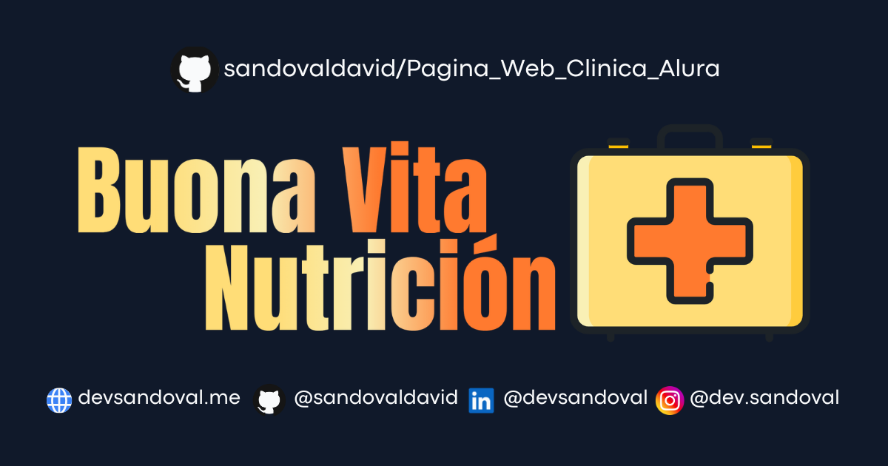
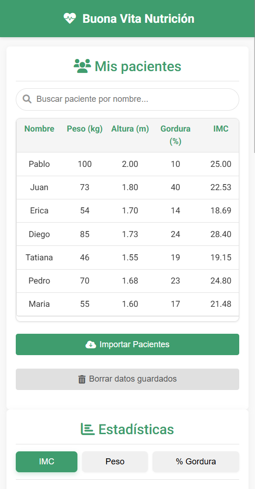
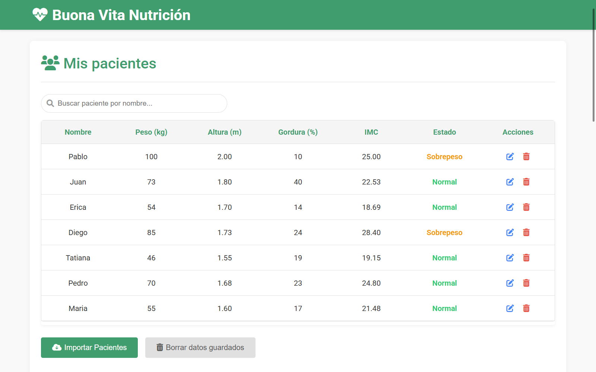

# 🏥 Buona Vita Nutrición - Sistema de Gestión Nutricional

[](https://opensource.org/licenses/MIT)
[](https://html.spec.whatwg.org/)
[](https://www.w3.org/Style/CSS/)
[](https://developer.mozilla.org/en-US/docs/Web/JavaScript)
[](https://clinica-alura.devprojects.tech)
[](https://github.com/sandovaldavid/Pagina_Web_Clinica_Alura/releases)

<div align="center">
  
</div>

## 📋 Descripción

> **Buona Vita Nutrición** es un sistema web completo para que nutricionistas y profesionales de la
> salud gestionen datos de pacientes, calculen el Índice de Masa Corporal (IMC) y realicen
> seguimiento nutricional de forma eficiente y profesional.

## ✨ Características Principales

### 👥 Gestión de Pacientes

-   ✅ **Registro completo de pacientes** con datos personales y medidas corporales
-   🧮 **Cálculo automático de IMC** con clasificación por categorías
-   🔍 **Búsqueda y filtrado** de pacientes en tiempo real
-   🗑️ **Eliminación de pacientes** con confirmación y animaciones
-   ✏️ **Edición de datos** mediante interfaz modal intuitiva

### 💾 Persistencia de Datos

-   📦 **Almacenamiento local** para mantener información entre sesiones
-   ♻️ **Carga automática** de datos guardados al iniciar la aplicación
-   🔄 **Sincronización** con cambios en tiempo real

### 📊 Visualización de Datos

-   📈 **Gráficos interactivos** para análisis de tendencias
-   📉 **Estadísticas detalladas** del IMC, peso y gordura corporal
-   🎯 **Indicadores visuales** para estados de peso y categorías de IMC

### 🔔 Notificaciones y Validación

-   💬 **Sistema avanzado de notificaciones** con diferentes tipos de alertas
-   ✅ **Validación de datos en tiempo real** con feedback inmediato
-   ⚠️ **Prevención de errores** con mensajes claros y precisos

## 🚀 Demo

> ### [Ver Demo en Vivo](https://clinica-alura-demo.devsandoval.me/)

<div align="center">
  <table>
    <tr>
      <td align="center"><strong>📱 Móvil</strong></td>
      <td align="center"><strong>💻 Escritorio</strong></td>
    </tr>
    <tr>
      <td></td>
      <td></td>
    </tr>
  </table>
</div>

## 🛠️ Tecnologías Utilizadas

| Tecnología                                                                                                        | Uso                                   |
| ----------------------------------------------------------------------------------------------------------------- | ------------------------------------- |
|                 | Estructura semántica y accesible      |
|                    | Estilos responsivos y animaciones     |
|  | Lógica del cliente e interactividad   |
|        | Visualizaciones gráficas interactivas |
|             | Integración con servicios externos    |

## 🚦 Requisitos del Sistema

-   Navegadores modernos con soporte para ES6 y localStorage:
    -   Chrome (última versión)
    -   Firefox (última versión)
    -   Safari (última versión)
    -   Edge (última versión)

## 📝 Notas de Versión

### 📣 Novedades en v2.0.0

> ¡Gran actualización con nuevas características y mejoras significativas!

-   💾 Persistencia de datos con localStorage
-   ✏️ Capacidades de edición de pacientes
-   📊 Visualizaciones estadísticas con Chart.js
-   🔔 Sistema avanzado de notificaciones
-   📱 Mejoras en el diseño responsivo

[Ver notas completas de la versión 2.0.0](https://github.com/sandovaldavid/Pagina_Web_Clinica_Alura/releases/tag/v2.0.0)

### 📋 Historial de versiones

-   [Notas de la versión 1.0.0](https://github.com/sandovaldavid/Pagina_Web_Clinica_Alura/releases/tag/v1.0.0)

## 🚀 Iniciando el Proyecto

1. **Clonar el repositorio**

```bash
git clone https://github.com/sandovaldavid/Pagina_Web_Clinica_Alura.git
```

2. **Navegar al directorio del proyecto**

```bash
cd Pagina_Web_Clinica_Alura
```

3. **Abrir en el navegador**

Abrir el archivo index.html en tu navegador preferido o usar la extension de
[LiveServer](https://marketplace.visualstudio.com/items/?itemName=ritwickdey.LiveServer) de VSCode

4. **¡Listo para usar!**

## 🤝 Contribuciones

Las contribuciones son bienvenidas. Para cambios importantes:

1. 🍴 Haz un fork del proyecto
2. 🔄 Crea tu rama de características (`git checkout -b feature/amazing-feature`)
3. 📝 Haz commit de tus cambios (`git commit -m 'Add: amazing feature'`)
4. 📤 Haz push a la rama (`git push origin feature/amazing-feature`)
5. 🔍 Abre un Pull Request

## 📜 Licencia

Este proyecto está licenciado bajo la Licencia MIT - ver el archivo [LICENSE](LICENSE) para más
detalles.

---

## 👨‍💻 Autor

### [David Sandoval](https://devsandoval.me/)

-   🌐 Portafolio: [devsandoval.me](https://devsandoval.me)
-   💼 LinkedIn: [@devsandoval](https://linkedin.com/in/devsandoval)
-   💻 GitHub: [@sandovaldavid](https://github.com/sandovaldavid)
-   📧 Email: [contact@devsandoval.me](mailto:contact@devsandoval.me)

---

<div align="center">
  <p>
    <small>Desarrollado por <a href="https://devsandoval.me/">David Sandoval</a></small><br>
  </p>
</div>

---

> **Nota**: Este proyecto fue creado con fines educativos y de entretenimiento. Siéntete libre de
> utilizarlo y modificarlo según tus necesidades.
